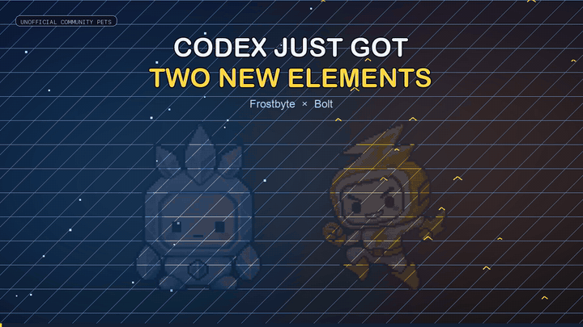
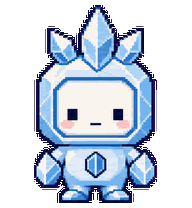
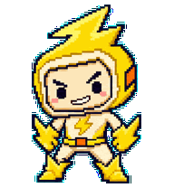

<p align="center">
  
</p>

<h1 align="center">Frostbyte × Bolt</h1>

<p align="center">
  Two high-quality elemental companions for Codex: one cool-headed, one high-voltage.
</p>

<p align="center">
  <a href="https://ashyboy219.github.io/codex-elemental-pets/"><strong>Watch the showcase</strong></a>
  ·
  <a href="https://github.com/Ashyboy219/codex-elemental-pets/releases/latest"><strong>Get the pet pack</strong></a>
</p>

## Meet the pets

| Frostbyte | Bolt |
| --- | --- |
|  |  |
| A cool-headed crystal companion for precise, patient work. | A bright, restless spark for rapid experiments and brave first passes. |

Their personalities are built into their silhouettes and motion. Frostbyte is balanced, faceted, and composed. Bolt is asymmetric, forward-leaning, and visibly impatient to move.

## Install

Clone the repository and run the installer:

```bash
git clone https://github.com/Ashyboy219/codex-elemental-pets.git
cd codex-elemental-pets
./install.sh
```

On Windows PowerShell:

```powershell
git clone https://github.com/Ashyboy219/codex-elemental-pets.git
cd codex-elemental-pets
./install.ps1
```

Or copy each folder under `pets/` into `${CODEX_HOME:-$HOME/.codex}/pets/`, then restart Codex if needed.

## Why these are more than character stickers

Each pet includes:

- a validated `1536 × 2288` transparent WebP atlas;
- 11 animation rows and 73 populated frames;
- idle, directional movement, waving, jumping, failure, waiting, active-work, and review states;
- 16 clockwise look directions with explicit cardinal, continuity, and blind-direction QA;
- `spriteVersionNumber: 2` packaging for the extended custom-pet format;
- a stable identity, palette, silhouette, face, and personality across every state.

## Media kit

- [Vertical video — Reels, TikTok, Shorts, and mobile feeds](media/showcase-vertical-1080x1920.mp4)
- [Landscape video — X, LinkedIn, YouTube, and presentations](media/showcase-landscape-1920x1080.mp4)
- [Square launch image](media/poster-square-1080x1080.png)
- [Landscape launch image](media/poster-landscape-1200x675.png)
- [Ready-to-post captions and launch checklist](social/POSTS.md)
- [Prepared OpenAI Developer Showcase submission](SHOWCASE_SUBMISSION.md)

## Build notes

The pets were designed and produced through Codex using grounded image generation plus deterministic atlas assembly and validation. The social media was rendered from the final approved spritesheets; it does not redraw or replace the pet artwork.

Rebuild the media with the bundled workspace Python runtime and FFmpeg:

```bash
python3 scripts/build_media.py
```

## License and status

Code is MIT licensed. Pet art, animation assets, and promotional media are shared under CC BY 4.0; see [ASSET-LICENSE.md](ASSET-LICENSE.md).

This is an unofficial community project and is not affiliated with or endorsed by OpenAI. The custom pet format may evolve.
